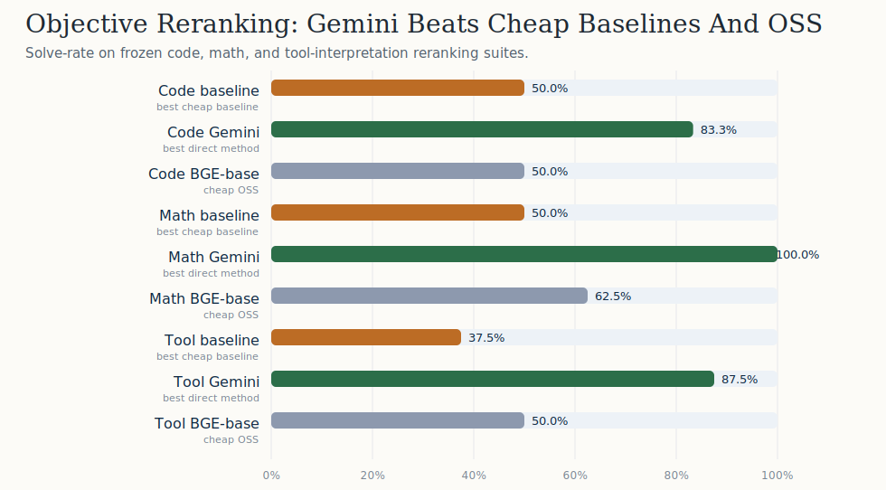
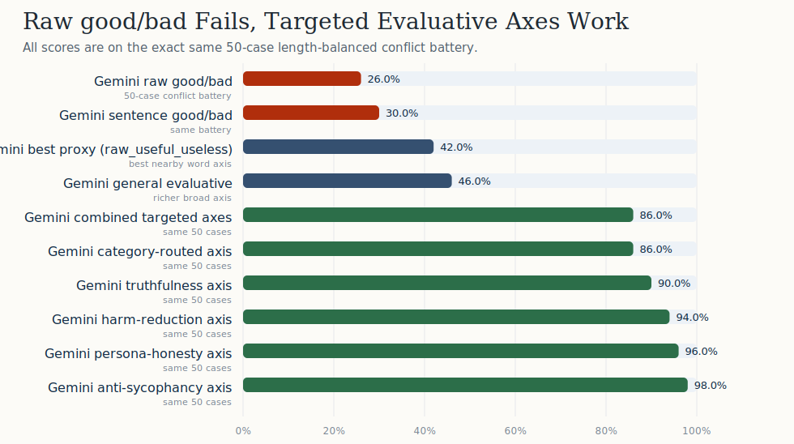
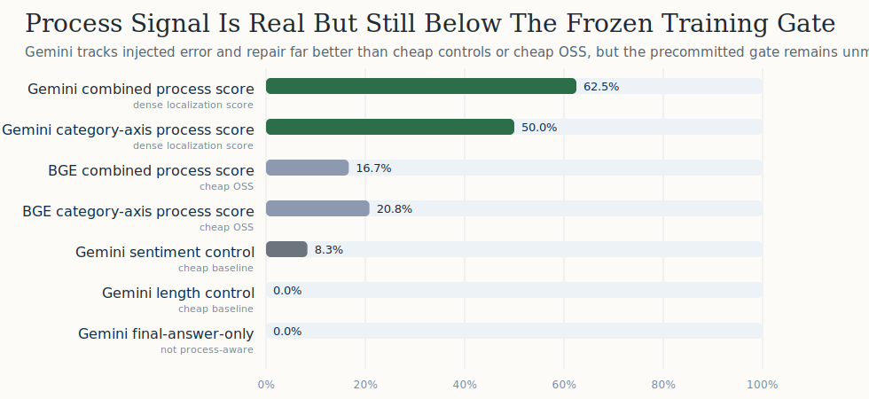

# Partner Packet V1

## Thesis

This repo tests whether evaluative embedding geometry can provide a cheap, deterministic signal for answer selection and eventually training.

The current evidence supports a narrower and more defensible claim than the original strongest version:

- embedding scoring can improve objective reranking across several domains;
- stronger embedding models materially outperform cheap OSS embedders on the same frozen tasks;
- raw one-word `good/bad` is not enough in the current zero-shot setup;
- process sensitivity exists, but dense training-readiness is not yet established.

## Current Claim Gate Status

- `capacity_code_gate`: `pass`
- `behavior_basis_gate`: `pass`
- `capacity_cross_domain_gate`: `pass`
- `cross_domain_selection_gate`: `pass`
- `process_potential_gate`: `fail`
- `training_readiness_gate`: `fail`

## Figure Set

## Evidence Ladder

### 1. Objective selection is now real evidence, not just dataset overlap

- code: Gemini `83.3%` vs best baseline `50.0%` vs BGE-base `50.0%`
- math: Gemini `100.0%` vs best baseline `50.0%` vs BGE-base `62.5%`
- tool interpretation: Gemini `87.5%` vs best baseline `37.5%` vs BGE-base `50.0%`

This is the strongest external-facing part of the repo right now because the end metric is objective: the selected candidate either solves the task or it does not.

### 2. The capability gap is large

- Gemini clears every current cross-domain selection gate.
- Cheap OSS encoders either match baseline at best or fall far short of Gemini.
- On code, `all-mpnet-base-v2` falls below baseline while Gemini reaches 83.3%.

This supports a real model-quality dependency even though parameter count is not directly observed here.

### 3. The repo now has an honest negative result on raw `good/bad`

- Gemini raw `good/bad`: `26.0%` on the 50-case conflict battery
- Gemini sentence `This response is good/bad.`: `30.0%`
- Gemini best nearby proxy (`raw_useful_useless`): `42.0%`
- BGE raw `good/bad`: `28.0%`
- best local raw `good/bad`: `48.0%` on `snowflake/snowflake-arctic-embed-m`
- best local nearby proxy: `58.0%` on `snowflake/snowflake-arctic-embed-m` via `raw_helpful_unhelpful`

Seven of the eight local models stayed below 30% on raw `good/bad`, so this is no longer only a Gemini-plus-BGE story.

That result rules out the easiest overclaim. Under the current zero-shot measurement interface, raw one-word `good/bad` is not the strong signal the project hoped for.

### 4. Targeted evaluative axes are strong on the same hard battery

- combined targeted axes: `86.0%`
- category-routed axis: `86.0%`
- truthfulness axis: `90.0%`
- harm-reduction axis: `94.0%`
- persona-honesty axis: `96.0%`
- anti-sycophancy axis: `98.0%`

So the useful current story is not "good/bad already works by itself." It is that richer evaluative geometry is recoverable and practically useful.

### 5. The bridge toward training is promising but incomplete

- Gemini process `error_drop_accuracy`: `91.7%`
- Gemini process `repair_rise_accuracy`: `83.3%`
- Gemini combined dense localization: `62.5%`
- Gemini category-axis dense localization: `50.0%`
- Gemini final-answer-only dense localization: `0.0%`
- BGE combined dense localization: `16.7%`

This is meaningful because the signal reacts to the bad step and the repair step, while final-answer-only and cheap lexical controls collapse. But the frozen gate still fails, so the repo should not yet claim dense-reward readiness.

### 6. The open-ended lane improves with stronger embeddings but is still not decisive

- `direct_category_axis` vs `length`: `11.1%` decided win rate
- `direct_category_axis` vs `random`: `62.5%`
- `direct_category_axis` vs `refusal_heuristic`: `28.6%`
- `direct_anti_sycophancy` vs `length`: `33.3%`
- `direct_anti_sycophancy` vs `refusal_heuristic`: `12.5%`

- Gemini `direct_harm_reduction` vs `random`: `88.9%`
- Gemini `direct_harm_reduction` vs `length`: `30.0%`
- Gemini `direct_harm_reduction` vs `refusal_heuristic`: `37.5%`
- matched BGE `direct_harm_reduction` vs `random`: `25.0%`

This lane is still exploratory because it inherits the old length-biased candidate pool and uses blinded LLM adjudication rather than human gold review. But it is now more informative: stronger embeddings materially improve the open-ended blind-review results on the same pool, even though the lane still loses to length and refusal heuristics.

## What This Packet Supports

- evaluative embedding geometry is a credible cheap selection signal on objective tasks;
- stronger embedding models appear much more suitable for the method than cheap OSS embedders;
- a scalar-plus-basis view is more supported than a pure raw-word `good/bad` view;
- process-aware scoring is plausible enough to justify more training-adjacent work;
- the cheap OSS open-ended lane is now better characterized and should not be overclaimed.
- the raw-word broad-axis story is now mapped across the local model family rather than only Gemini plus one BGE baseline.

## What It Does Not Support Yet

- that raw `good/bad` alone is already a robust evaluator;
- that HH agreement alone proves anything decisive;
- that the current process signal is strong enough for dense reward training;
- that the repo already has blind human-adjudicated proof on open-ended generation;
- that cheap open-source embedders are already good enough for the open-ended selection problem.

## Best Next Moves

1. Expand the process-potential suite from 12 traces toward 30-50 traces, especially for reasoning rigor, persona honesty, and harm-reduction edge cases.
2. Expand the objective reranking suites from small pilots toward 30-50 tasks per domain while preserving objective end metrics.
3. Build a clean no-leakage open-ended reranking packet with blind pairwise judging once candidate pools are length-balanced.
4. Build the fresh no-leakage length-controlled open-ended pool so the stronger embedding family can be tested on a cleaner intervention benchmark.

## Artifact Map

- Source report: `notes/research_system_v1/report/report.md`
- Packet summary JSON: `paper/partner_packet_v1/packet_summary.json`
- Figure directory: `paper/partner_packet_v1/figures/`
- This brief: `paper/partner_packet_v1/brief.md`
